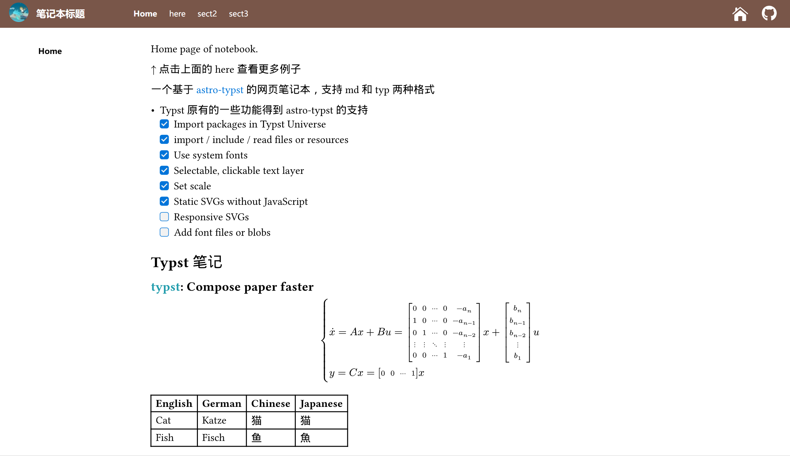

# Astro-typst Notebook

一个基于 [astro-typst](https://github.com/OverflowCat/astro-typst/tree/master) 的网页笔记本，支持 md 和 typ 两种格式

- Typst 原有的一些功能得到 astro-typst 的支持
  - [x] Import packages in Typst Universe
  - [x] import / include / read files or resources
  - [x] Use system fonts
  - [x] Selectable, clickable text layer
  - [x] Set scale
  - [x] Static SVGs without JavaScript
  - [ ] Responsive SVGs
  - [ ] Add font files or blobs

没有使用 Astro 原有的 content 内容集合（~~其实是不会~~）和 pages 内自动静态路由（也就是能够兼容）

实现方式非常丑陋且笨拙，不会前端且不熟悉 Astro，孩子不懂事做着玩的（x

- 例子


- 使用方法为直接在 `src/docs` 下添加文件，例如
```
src/docs
    ├── note.typ              // first level must have note.md/typ
    ├── here
    │   ├── index.typ         // second level must have index.md/typ
    │   ├── test
    │   │   ├── 基本测试.typ
    │   │   └── 第三方包.typ
    │   └── to2
    │       ├── 1.md
    │       └──2.typ
    ├── sect2
    │   ├── index.md
    │   ├── topic1
    │   │   └── 1.md
    │   └── topic2
    │       └── 1.typ
    ├── sect3
    │   ├── index.typ
    │   └── no_files_so_no_this
    └── sect4
        └── no_index_so_no_this
```
